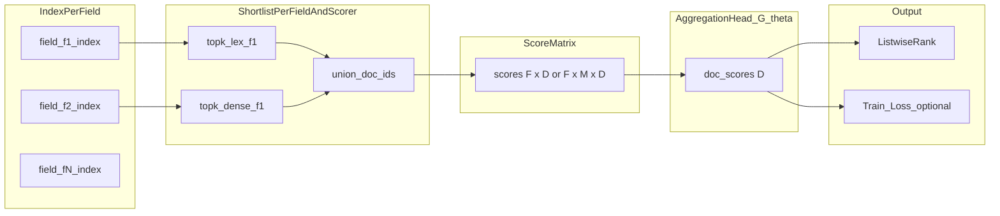
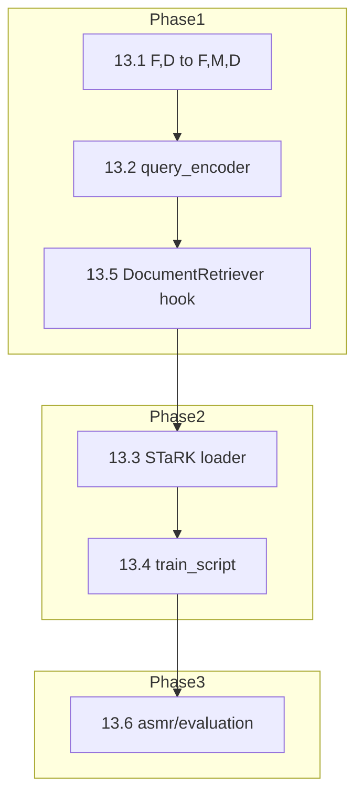
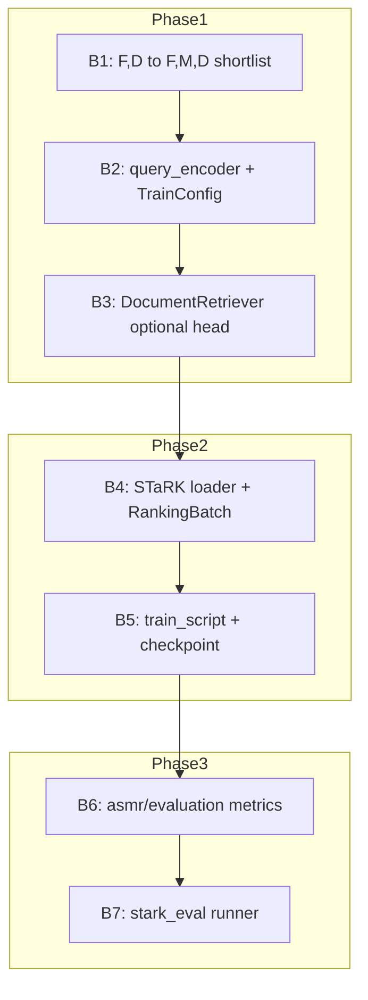

# ASMR: Trainable retrieval — 코드 레벨 기술 상세 설계

상위 개요: [trainable-retrieval-design.md](./trainable-retrieval-design.md)  
프로젝트 목표 메모: [job-request.md](../../job-request.md) (루트)

이 문서는 **evidence composition-first** 확장을 **구현 워크플로우**(데이터 파이프라인, 텐서 계약, 모듈 경계, 학습·추론 루프) 단위로 구체화한다. mFAR 논문(Li et al., ICLR 2025, arXiv:2410.20056)과 M3-Embedding / BGE-M3 논문(Chen et al., arXiv:2402.03216)의 **문제 설정 차이**를 벤치마킹 섹션에서 명시적으로 분리한다.

---

## 1. Scope and non-goals

**In scope**

- 필드별 인덱스(BM25, dense FAISS 등) 위에서 **질의 조건부**로 문서 점수를 만드는 **가벼운 학습 가능 헤드** `G_θ` 및 보조 특성 파이프라인.
- mFAR과 정렬 가능한 **baseline**(적응 가중 + 대조 학습)과, 그 위의 **composition·role·consistency** 확장.
- STaRK 계열 **멀티필드** 평가 프로토콜 및, BGE-M3를 **substrate/teacher**로 쓸 때의 **보조** 평가 축(MIRACL, MKQA 등).

**Non-goals**

- BGE-M3 규모의 **처음부터 통합 임베딩 사전학습**을 asmr 단일 패키지 안에서 재현하는 것(비용·목적 불일치; 논문 §13 철학과 동일하게 정면승부 회피).
- 전 코퍼스에 대한 **무거운 cross-encoder 1차 검색**(지연·비용; 후보 shortlist 위 re-rank는 선택적 후속).

---

## 2. End-to-end workflow (코드 매핑)

### 2.1 단계 개요



| 단계 | 역할 | asmr 코드 앵커 |
|------|------|----------------|
| A | 문서를 필드로 분해해 **필드별** 인덱스 구축 | `asmr/index/fields.py`, `index/bm25.py`, dense 인덱스 |
| B | 질의 `q`에 대해 필드 `f`·스코어러 `m`(lexical/dense)별 **top-k 후보** | `retrieve/retrievers.py` — `QueryRouter.retrieve(field, q, k)` |
| C | 후보 **합집합**에 대해 각 `(f,m)` 스코어 행렬 채움 | [`retrieve/aggregate.py`](../src/asmr/retrieve/aggregate.py) — `aggregate_field_scores_async` → `(doc_ids, scores)` |
| D | (학습/추론) **문서 점수** `s(q,d)` = `G_θ(·)` | 신규 `asmr/train/aggregation.py` 등(본 문서 §6) |
| E | (학습) ranking·보조 손실 | `asmr/train/losses.py` |

**추론 (mFAR와 동일한 근사)**  
전 코퍼스에 대해 모든 `(f,m,d)` 조합을 계산하지 않고, 필드·스코어러별 shortlist의 **합집합**에서만 최종 점수를 계산한다(arXiv:2410.20056 §2.2). asmr의 `aggregate_field_scores_async`는 이미 “필드별 top-k → 합집합 정렬” 패턴에 맞춰져 있다.

### 2.2 학습 시 데이터 흐름 (배치)

1. **샘플** `(q, d_plus, D_minus, meta)` — `meta`에 필드 레벨 weak 라벨·스키마 태그·counterfactual 플래그(선택).
2. **후보 집합** `C' = {d_plus} ∪ D_minus ∪ (선택 in-batch positives)` 에 대해 인덱스에서 **점수 행렬** 조회 또는 on-the-fly 검색으로 동일 shape 생성.
3. `FeatureBuilder`: §5의 aux 벡터 계산.
4. `AggregationHead`: `s ∈ ℝ^{|C'|}` 출력.
5. `LossBundle`: §7.

### 2.3 추론 시 데이터 흐름

1. `DocumentRetriever` / `aggregate.retrieve_documents`로 `(doc_ids, scores[field, doc])` 획득.  
2. 선택적으로 `G_θ`에 태워 최종 리스트 정렬.  
3. Baseline: `tests/integration/helpers/scoring_helper.py` 의 **필드 합산**은 **비학습 baseline**으로 유지·비교.

---

## 3. Tensor contracts (텐서 계약)

### 3.1 기호

- `F`: 필드 개수(스키마 고정 순서, 예: `fields.json` 또는 `FieldConfig` 리스트 순서).
- `M`: 스코어러 개수 — 최소 `{lexical, dense}` 로 `M=2`(mFAR §2.2). 확장 시 multi-vector per field은 `M` 증가 또는 별도 re-rank 스테이지.
- `D`: 배치 내 **후보 문서** 수(합집합 shortlist 길이, 상한 `D_max`).
- `B`: 질의 배치 크기(학습 시).

### 3.2 필수 텐서

| 이름 | shape | dtype | 설명 |
|------|--------|--------|------|
| `scores_raw` | `[B, F, M, D]` 또는 `[B, F, D]` (M이 합쳐진 경우) | float32 | 각 후보 문서 슬롯에 대한 필드·스코어러 유사도. **문서에 필드 값이 없으면** 해당 슬롯은 `-inf` 또는 0 + **마스크**. |
| `field_mask` | `[B, F, D]` | bool | 문서 `d`가 필드 `f`를 가지면 True. |
| `scorer_mask` | `[B, F, M, D]` | bool | 선택: 특정 스코어러만 유효할 때. |
| `query_emb` | `[B, H]` | float32 | 질의 임베딩(`q`); mFAR의 적응 함수 `G(q,f,m)` 입력. |
| `field_emb` | `[F, R]` | float32 | 필드 이름/역할용 임베딩(학습 가능 또는 고정 lookup). |
| `aux` | `[B, D, A]` | float32 | §5 consistency·통계 특성. |

### 3.3 스코어 정규화 (설계 선택지)

mFAR는 스코어러·필드별 스케일 차이를 완화하기 위해 **필드×스코어러별 batch normalization**(whitening + 학습 가능 `γ`, `β`)을 실험한다(arXiv:2410.20056 §2.2). 구현 시 선택지:

- **Opt A**: 학습 배치 내에서 `(f,m)`별 mean/var 정규화 후 `γ,β` (mFAR 정렬).
- **Opt B**: 고정 min-max 또는 rank-based 정규화(온라인 서빙에 유리).
- **Opt C**: 정규화 없이 `G_θ` 첫 층에만 affine — 데이터가 작으면 **Opt A 추천**(개정 근거는 §11).

출력 문서 점수는 최종적으로 **listwise·pairwise loss**에 들어가므로 temperature `τ`와 함께 튜닝한다(mFAR 식 (1)).

---

## 4. 모듈 설계 (제안 패키지)

`trainable-retrieval-design.md` §6과 동일 계열:

```
asmr/src/asmr/train/
  __init__.py
  config.py           # τ, λ들, D_max, G_theta hidden, dropout
  data.py             # Dataset: STaRK 포맷 → 텐서 배치
  features.py         # FeatureBuilder: aux §5
  aggregation.py      # FieldRoleProjector + AggregationHead (G_theta)
  losses.py           # contrastive + optional field-level + distillation
  trainer.py          # PyTorch Lightning 등 — 의존성은 pyproject에서 확정
```

**기존 코드 호출 지점**

- `retrieve/aggregate.py`: 추론 시 `scores` 산출 직후 optional hook `apply_aggregation_head(...)`.
- `retrieve/helpers.py`: 학습 플래그 시 동일 hook.

---

## 5. FeatureBuilder (auxiliary features)

v1에서 **저비용·재현 가능**한 항목만 필수로 둔다(§11 critique).

| 특성 그룹 | 예시 | 차원 |
|-----------|------|------|
| per-doc 통계 | 필드 점수 분산, max/min 비율, top-k 필드 개수 | 소수 |
| coverage | 질의 토큰/서브워드가 상위 필드 텍스트에 등장하는 비율(휴리스틱) | 소수 |
| disagreement | lexical vs dense 순위 불일치 rank diff | 1~2 |
| missing | must-have 필드 결손(규칙 또는 학습 마스크) | 1 |

v2+: 소형 NLI로 필드 텍스트 쌍 entailment — **비용·지연** 검토 후.

---

## 6. AggregationHead: `G_θ` vs mFAR `G`

### 6.1 mFAR baseline (재현·비교용)

적응 가중:

\[
G(q,f,m) = \mathrm{softmax}_{(f,m)} \big( \mathbf{a}_{f,m}^\top \mathbf{q} \big)
\]

문서 점수:

\[
s(q,d) = \sum_{f,m} G(q,f,m)\cdot \tilde{s}_{f,m}(q,x_d^f)
\]

여기서 \(\tilde{s}\)는 정규화된 필드별 스코어. 이는 **선형·해석 가능**하며 ablation **No query-conditioning**(전역 `w_{f,m}`만) 대비 성능 하락이 mFAR Table 2에서 크게 관찰된다.

### 6.2 확장: 작은 `G_θ`

입력 concat: `[flatten(scores for d), query_emb, pooled field_emb, aux]` → MLP 1~2층 → 스칼라 `s(q,d)`.

- **파라미터 상한** 예: hidden ≤ 256, 1층 MLP 또는 gated bilinear.
- **초기화**: `G_θ` 마지막 층을 **mFAR식 softmax 가중**에 가깝게 두거나, 첫 학습 에폭은 **frozen linear G**만 사용(§11).

### 6.3 FieldRoleProjector (선택)

필드명 임베딩 \(\psi(f)\)와 역할 프로토타입 \(\{r_k\}\)의 유사도로 혼합 계수 생성 → `G_θ` 또는 가중 결합에 주입.

---

## 7. Loss bundle (의사코드)

```text
# Inputs: batch of queries, each with shortlist doc_ids and scores tensor

def forward_batch(batch):
    scores = batch.scores_raw          # [B, F, M, D]
    mask = batch.field_mask            # [B, F, D]
    q_emb = encode_query(batch.text) # shared with field encoders in mFAR

    aux = FeatureBuilder(scores, mask, batch.query_tokens, batch.field_texts)
    logits = AggregationHead(scores, q_emb, aux)  # [B, D]

    # Primary: listwise softmax / pairwise hinge on positives vs negatives
    L_rank = ranking_loss(logits, batch.relevance_labels)  # relevance: 0/1 per doc slot

    # Optional: mFAR-style contrastive on shared encoder (if end-to-end finetune)
    L_c = contrastive_loss(encoder_q, encoder_d_pos, encoder_d_negs)

    # Optional: field-level weak supervision
    L_field = bce(field_logits, batch.weak_field_labels)

    # Optional: teacher distillation (BGE-M3 ensemble score on same candidates)
    L_distill = kl(student_logits, teacher_scores)

    return λ_rank * L_rank + λ_c * L_c + λ_f * L_field + λ_d * L_distill
```

**mFAR 본문**은 공유 인코더에 대해 식 (1) `L_c`와 식 (2) bi-directional `L_b`를 함께 사용한다. asmr에서 **헤드만 학습**할 때는 `L_c`를 생략하거나, 상위에서 **frozen BGE-M3** 임베딩만 사용할 수 있다.

---

## 8. mFAR 정렬: baseline, ablation, 하이퍼파라미터 힌트

| 항목 | 논문 설정 | asmr 구현 메모 |
|------|-----------|----------------|
| Dense | Contriever-msmarco finetune on STaRK | 동일 재현 시 HF 체크포인트 정합; 대체로 BGE-M3 dense |
| Lexical | BM25 per field | `asmr/index/bm25.py` 경로 |
| Shortlist | per (f,m) top-k 후 합집합 | `aggregate_field_scores_async`와 동일 철학 |
| 학습 | in-batch negatives + bi-directional | 배치 크기: 논문은 데이터셋별 96~192(512 토큰 제한) |
| QC ablation | No query-conditioning | `AggregationHead`를 전역 가중으로 고정 |

**MFARAll+2** (단일 필드 문자열 + 멀티필드)는 단일 필드 채널을 추가 스코어로 두는 방식 — asmr에서는 **문서 전체 dense 한 줄** 스코어를 `scores`에 추가 채널로 넣는 것으로 대응 가능.

---

## 9. 벤치마킹: 논문·데이터셋·역할 분리

### 9.1 비교 축 (오해 방지)

두 논문은 **같은 “멀티필드 리더보드”를 공유하지 않는다.** 문서·발표에서 반드시 표를 나눈다.

| 축 | mFAR (2410.20056) | M3-Embedding / BGE-M3 (2402.03216) |
|----|-------------------|-------------------------------------|
| 핵심 기여 | 반정형 문서의 **필드 분해** + **쿼리 조건부** 가중 + hybrid lexical/dense | **다국어·다기능**(dense+sparse+multi-vec)·**장문** 통합 임베딩 + self-knowledge distillation |
| 대표 데이터 | **STaRK**: Amazon, MAG, Prime (노드→멀티필드 문서) | **MIRACL**, **MKQA**, MLDR 등 — **단일 패시지/문서** 검색이 주류 |
| 주 지표 | Hit@1, Recall@20, MRR (`trec_eval`) | MIRACL nDCG@10; MKQA R@100; (장문) MLDR 등 |
| asmr에서의 역할 | **Primary**: 구조적 멀티필드 성능 검증 | **Secondary**: 인코더·teacher·다국어 **회귀/이득** 측정; STaRK와 **직접 순위 비교 금지** |

### 9.2 Primary: STaRK (mFAR 프로토콜)

- **데이터**: STaRK — **Amazon**, **MAG**, **Prime** (Wu et al., STaRK-QA / knowledge graph 기반; mFAR §3.1).  
- **필드 수**(논문): Prime ≈ 22, Amazon ≈ 8, MAG ≈ 5 — 전처리는 STaRK·[microsoft/multifield-adaptive-retrieval](https://github.com/microsoft/multifield-adaptive-retrieval) 스크립트와 정합 권장.  
- **지표**: Hit@1, Recall@20, MRR.  
- **Baseline 목표**: [job-request.md](../../job-request.md) — 핵심 실험 대비 경쟁 가능 또는 ~90% 수준(프로젝트 목표; 구현은 별 작업).

### 9.3 Secondary: MIRACL / MKQA (BGE-M3 축)

- **MIRACL**: 18개 언어 단일 언어 검색, **nDCG@10**(논문 Table 1; Pyserini 파이프라인 언급).  
- **MKQA**: 25개 비영어 질의 → **영어 위키** 패시지, **Recall@100**(논문 §4.2).  
- **용도**: BGE-M3를 필드 인코더·teacher로 택했을 때 **다국어·교차 언어**에서의 품질 유지 여부.  
- **주의**: 이 지표만으로 “멀티필드 SOTA”를 주장할 수 없음(§9.1).

### 9.4 Slice / failure taxonomy (상위 설계 §4.4)

- 질의 유형별로 STaRK 쿼리를 태깅(규칙·소형 분류기·LLM 1회)해 **slice별 Hit@1 / R@20** 보고.  
- 예: 소수 필드만 관련 / conjunction 필요 / 메타데이터 제약 / title-bait.

### 9.5 평가 코드 위치

- 실험 코드는 **`asmr/src/asmr/evaluation/`** 에 위치한다 (`asmr.evaluation` 패키지).  
- **현재 레포**: `asmr/src/asmr/evaluation/metrics.py`, `stark_eval.py` 구현됨.

---

## 10. References (키 인용)

- Multi-Field Adaptive Retrieval: arXiv:2410.20056 — STaRK, `G(q,f,m)`, shortlist, metrics.  
- M3-Embedding: arXiv:2402.03216 — MIRACL, MKQA, hybrid dense+sparse+multi-vec, distillation.  
- STaRK / STaRK-QA: Wu et al. (mFAR §3.1 인용).

---

## 11. Critical review and design mitigations

| 주제 | 비판 | 완화 |
|------|------|------|
| `G_θ` 과적합 | 소규모 STaRK에서 MLP가 선형 `G`보다 불안정할 수 있음 | 파라미터 상한, dropout, L2; **warm-start**: mFAR형 linear softmax `G`로 초기화 후 미세조정 |
| 필드 감독 부재 | STaRK는 문서 단위 relevance가 중심일 수 있음 | 필드 라벨은 **weak supervision**(BM25 상위 필드, 규칙, LLM, CE attribution) 단계적 도입 |
| Cross-field entailment 비용 | 대형 CE·NLI는 서빙 비용 큼 | v1: §5 통계·coverage만; v2+: 소형 NLI 또는 배치 오프라인 캐시 |
| Neuro-symbolic | 타입 필드 파싱·유지보수 부담 | 스키마 태그 있는 필드만 symbolic 채널; 나머지 neural |
| 벤치 혼동 | BGE-M3 SOTA = 멀티필드 승리로 읽힘 | §9 표 고정; STaRK와 MIRACL/MKQA **분리 보고** |

---

## 12. Design revision log

| 날짜 | 변경 요약 | 근거 |
|------|-----------|------|
| 2026-04-07 | 초안 작성: 워크플로우, 텐서 계약, `G` vs `G_θ`, 손실 번들, STaRK vs MIRACL/MKQA 역할 분리, 평가 경로 메모 | 본 저장소 [trainable-retrieval-design.md](./trainable-retrieval-design.md) 및 mFAR/BGE-M3 논문 구조 정합 |
| 2026-04-07 | `G_θ`에 linear warm-start 및 정규화 Opt A 권장 명시 | 소데이터 과적합 위험(§11) |
| 2026-04-07 | `src/evaluation` 미존재 시 asmr 내부 eval로 시작한다고 명시 | [job-request.md](../../job-request.md)와 현 레포 상태 정합 |
| 2026-04-07 | §13 다음 단계 구현 추가; `trainable-retrieval-next-phase.plan` 내용을 §13(13.0·13.9–13.12)에 통합 후 plan 파일·`docs/plans/` 제거 | 단일 기술 문서 |
| 2026-04-14 | 평가 코드 경로 `src/evaluation` → `asmr/src/asmr/evaluation/` (`asmr.evaluation` 패키지)로 이관 | 루트 `src/` 제거, asmr 패키지 내 통합 |

*(이후 개정 시 행 추가.)*

---

## 13. 다음 단계 구현 (코드 레벨)

§1–§11까지는 **설계 원리**와 **이미 구현된** `asmr/train/` 헤드·손실·추론 경로를 다룬다. 이 절은 **아직 코드로 연결되지 않은** 단계를 **모듈·파일 단위**로 고정한다. 용어(shortlist, scorer 등)는 [trainable-retrieval-design.md §Terminology](./trainable-retrieval-design.md) 참고.

### 13.0 목적·현재 상태

**목적**

1. 설계와 구현 티켓이 대응되도록 **다음 코드 작업**을 고정한다.  
2. mFAR 정렬 shortlist(`[F,M,D]`), 질의 인코더, STaRK 연동, 학습 스크립트, `DocumentRetriever` 통합, `asmr/evaluation` 벤치를 단계적으로 완성한다.

**현재 상태 (요약)**

| 영역 | 상태 |
|------|------|
| `asmr/train/` 헤드·손실·추론 | 구현됨 (`MFARFieldAdapter`, `AggregationHead`, `apply_aggregation_head` 등) |
| `aggregate_field_scores_async` | `[F, D]` 단일 스코어러 — **mFAR식 `M`(lex+dense) 미분리** |
| `query_emb` 파이프라인 | 없음 |
| STaRK → `RankingBatch` | 없음 |
| `asmr/evaluation/` | `asmr/src/asmr/evaluation/` 구현됨 |

### 13.1 스코어 텐서 `M` 차원·hybrid shortlist

- **목표**: [`aggregate_field_scores_async`](../src/asmr/retrieve/aggregate.py)가 주는 **`[F, D]`** 를 mFAR 정렬에 맞게 **`[F, M, D]`** 로 확장한다. 최소 **`M=2`**(lexical + dense; §3.1 기호 `M`).
- **옵션 A**: `retrieve/aggregate.py`에 `aggregate_field_scores_hybrid_async` 등 — 필드마다 sparse·dense 인덱스를 각각 조회한 뒤 **동일 shortlist 합집합**에 대해 `(f,m)` 슬롯을 채운다.
- **옵션 B**: `QueryRouter` 스키마를 바꾸지 않고, **`asmr/train/shortlist.py`** (또는 학습 전용 래퍼)에서 필드별로 두 번 `retrieve` 후 행렬을 스택한다.
- **정합 이슈**: `doc_id`가 retriever 출력·`docid2col` 키에서 **str vs int**로 섞이면 열 정렬이 틀어진다. 구현 시 **한 타입으로 통일**하고, 본 절·코드 주석에 명시한다.

### 13.2 질의 임베딩 `query_emb`

- **목표**: `MFARFieldAdapter`·`AggregationHead`가 요구하는 **`query_emb` `[B, H]`** 를 생산한다.
- **산출물**: `asmr/train/query_encoder.py`(또는 `retrieve/query_encoder.py`) — HF `BAAI/bge-m3`, `facebook/contriever-msmarco` 등 단일 래퍼, `encode(texts) -> Tensor[B, H]`.
- **계약**: `TrainConfig.query_dim` / 헤드 생성자의 `query_dim`과 **`H` 일치**.

### 13.3 STaRK 데이터 파이프라인

- **입력**: STaRK 공식 스플릿 또는 [microsoft/multifield-adaptive-retrieval](https://github.com/microsoft/multifield-adaptive-retrieval) 전처리·필드 정의.
- **출력**: 배치마다 shortlist 상의 `scores`, `field_mask`, `relevance` → 기존 [`RankingBatch`](../src/asmr/train/data.py).
- **산출물**: `asmr/train/data.py` 확장 — `StarkRankingDataset`, `collate_ranking_batch` 등.

### 13.4 학습 스크립트

- **산출물**: `asmr/train/train_script.py` 또는 `python -m asmr.train.run`.
- **내용**: 옵티마이저, 에폭 루프, `normalize_scores_per_field_scorer`(§3.3 Opt A) 적용 여부, 체크포인트 저장/로드, `AggregationTrainer.training_step` 호출.

### 13.5 추론 통합

- **목표**: [`DocumentRetriever`](../src/asmr/retrieve/helpers.py)가 `(doc_ids, scores)`를 받은 뒤 **선택적으로** 학습된 헤드로 재정렬.
- **인터페이스**: optional `aggregation_head`, `query_encoder` 또는 사전 계산 `query_emb`; **`torch` 미설치** 시 기존 aggregate-only 경로 유지(지연 import).

### 13.6 평가: `asmr/evaluation`

- **`asmr/src/asmr/evaluation/`** 에 Hit@1, Recall@20, MRR을 둔다(`trec_eval` 서브프로세스 또는 `pytrec_eval` 등).
- **산출물**: `metrics.py`, STaRK용 `stark_eval.py` runner — asmr 인덱스·헤드·데이터 로더를 호출.
- **성공 기준**: job-request의 핵심 실험 대비 **경쟁 가능 또는 약 90%** — 본 모듈에서 수치 보고.

### 13.7 (선택) Phase 2 — 인코더 대조 학습

- mFAR 본문의 **공유 인코더** + 식 (1)(2) **대조·양방향 손실**(`L_c`, `L_b`)을 끝까지 올릴 경우, **헤드만 학습하는 Phase 1**과 브랜치·하이퍼파라미터를 분리한다.

### 13.8 권장 구현 순서 (요약)



### 13.9 작업 ID(B1–B7)와 산출물

절 번호(13.1–13.6)와 대응하는 **구현 티켓** 표기다.



| ID | 작업 | 산출물 |
|----|------|--------|
| B1 | Hybrid shortlist: 필드×스코어러×문서 `[F,M,D]` + 합집합 shortlist | `aggregate` 확장 또는 `asmr/train/shortlist.py` |
| B2 | HF 기반 `query_emb` `[B,H]` | `asmr/train/query_encoder.py` |
| B3 | `DocumentRetriever`에 optional head 경로 | `retrieve/helpers.py` (+ optional import) |
| B4 | STaRK 로더 + collate | `asmr/train/data.py` 확장 |
| B5 | 학습 루프 + 체크포인트 | `asmr/train/train_script.py` 등 |
| B6 | Hit@1, R@20, MRR | `asmr/evaluation/metrics.py` |
| B7 | STaRK 평가 runner | `asmr/evaluation/stark_eval.py` |

**프로젝트 성공 기준** ([job-request.md](../../job-request.md)): 핵심 실험 대비 경쟁 가능 또는 약 **90%** 수준 — B6–B7에서 측정.

### 13.10 품질 게이트

- `asmr/tests/unit`: shortlist shape, `RankingBatch`, `apply_aggregation_head` e2e (torch 사용 가능 환경).  
- `uv run ruff format` → `ruff check --fix` → `uv run mypy` (변경 경로, [CLAUDE.md](../../CLAUDE.md)).  
- STaRK **소규모 샘플** 스모크(전체 벤치는 별도 리소스).

### 13.11 범위 밖 (명시적 보류)

- 필드 단위 weak supervision 전체 LLM 파이프라인.  
- MIRACL/MKQA 전 벤치 재현(teacher 회귀 **스모크**만 고려).

### 13.12 실행 체크리스트 (Todo)

| # | 항목 | 상태 |
|---|------|------|
| 1 | §13 본문·revision log (본 문서) | done |
| 2 | `[F,D]`→`[F,M,D]` + `doc_id` 정합 | done — `aggregate_field_scores_hybrid_async`, str `doc_id` |
| 3 | `query_encoder.py` | done — `asmr/train/query_encoder.py` (`HfQueryEncoder`) |
| 4 | STaRK 로더 + `RankingBatch` collate | done — `asmr/train/data_stark.py` |
| 5 | 학습 스크립트 + 체크포인트 | done — `asmr/train/train_script.py`, `python -m asmr.train` |
| 6 | `DocumentRetriever` optional aggregation head | done — `retrieve_with_aggregation_head` |
| 7 | `asmr/evaluation` + STaRK runner | done — `asmr/evaluation/metrics.py`, `stark_eval.py` (qrels 연동은 데이터 준비 시) |

---

## 14. 한 줄 정리

구현 관점에서 asmr trainable 층은 **`aggregate`가 만든 `[F,(M),D]` 점수와 질의 임베딩·aux 특성을 받아 문서별 스칼라 점수를 내는 얇은 헤드**이며, 벤치는 **멀티필드는 STaRK+mFAR 프로토콜**, **다국어·통합 스코어량은 MIRACL/MKQA 등 BGE-M3 축**으로 나누어 보고한다. **다음 구현 단계**는 **§13**을 따른다.
